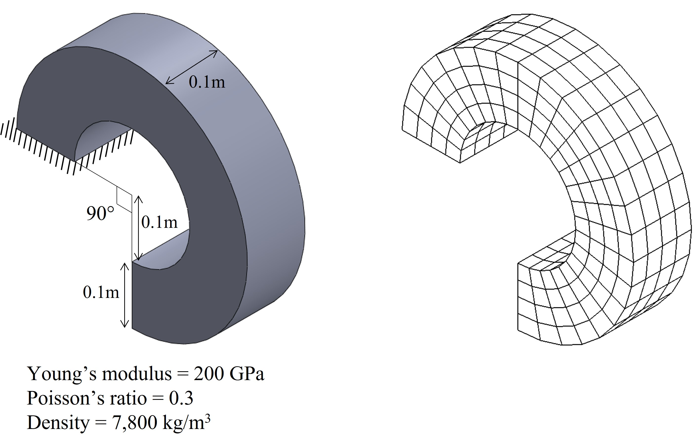

# Finite element solution of the generalized eigenvalue problem

An example code for the solution of the generalized eigenvalue problem in structural analysis. [Eigen](https://eigen.tuxfamily.org/index.php?title=Main_Page) is used for linear algebra.

1. A vibration analysis given in "/example". 
  
The natural frequencies of the structure are solved using the mesh. The mesh data is "/example/mesh_slenderRing.txt".<br/>
2. The incompatible mode element [1] is used for discretization, and the generalized eigenvalue problem is solved using [Spectra](https://spectralib.org/)
3. To run the executable "main" in the directory "build", open the terminal in the directory and enter
 
```
  ./main ../mesh_slenderRing.txt
```

## Reference
[1] Bathe, Klaus-Jürgen. Finite element procedures. Klaus-Jurgen Bathe, 2006.


